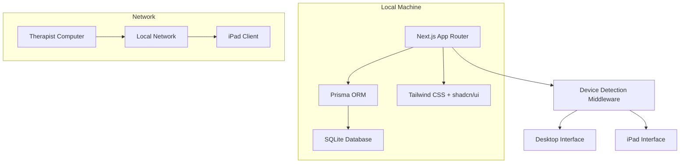

# Design Document: Patient Management System (Ebers)

## Overview

Ebers is a comprehensive patient management system built for psychology practices using Next.js 16.1.1 with App Router, TypeScript, Prisma ORM, and SQLite. The system provides patient registration, consultation management, credit tracking, and financial oversight while supporting both desktop and iPad interfaces for optimal workflow.

The architecture follows a local-first approach where all data is stored on the therapist's machine using SQLite, with the system creating a local network for iPad connectivity during patient self-registration.

## Architecture

### Technology Stack

- **Frontend/Backend**: Next.js 16.1.1 with App Router
- **Language**: TypeScript with strict type safety
- **Database**: SQLite (latest LTS version)
- **ORM**: Prisma
- **Styling**: Tailwind CSS 4.1 + shadcn/ui components
- **Development Approach**: Test-Driven Development (TDD)
- **Deployment**: Local machine hosting

### System Architecture



### Application Structure

```
app/
├── layout.tsx                 # Root layout with sidebar
├── page.tsx                   # Dashboard/home page
├── patients/
│   ├── page.tsx              # Patient listing
│   ├── new/page.tsx          # New patient form
│   ├── [id]/
│   │   ├── page.tsx          # Patient details/edit
│   │   └── consultation/
│   │       └── [consultationId]/page.tsx
├── consultations/
│   ├── page.tsx              # Consultation history
│   └── [id]/page.tsx         # Consultation details
├── financial/
│   └── page.tsx              # Financial control
├── api/
│   ├── patients/route.ts     # Patient CRUD operations
│   ├── consultations/route.ts # Consultation operations
│   └── credits/route.ts      # Credit management
├── components/
│   ├── ui/                   # shadcn/ui components
│   ├── forms/               # Form components
│   ├── layout/              # Layout components
│   └── consultation/        # Consultation-specific components
└── lib/
    ├── prisma.ts            # Prisma client
    ├── validations.ts       # Zod schemas
    ├── utils.ts             # Utility functions
    └── device-detection.ts  # Device detection logic
```

## Components and Interfaces

### Core Data Models

#### Patient Model
```typescript
type Patient = {
  id: string
  name: string
  profilePhoto?: string
  birthDate: Date
  gender: 'MALE' | 'FEMALE' | 'NON_BINARY'
  cpf?: string
  rg?: string
  religion: Religion
  legalGuardian?: string
  legalGuardianEmail?: string
  legalGuardianCpf?: string
  phone1: string
  phone2?: string
  email?: string
  hasTherapyHistory: boolean
  therapyHistoryDetails?: string
  takesMedication: boolean
  medicationSince?: string
  medicationNames?: string
  hasHospitalization: boolean
  hospitalizationDate?: string
  hospitalizationReason?: string
  consultationPrice?: number
  consultationFrequency?: ConsultationFrequency
  consultationDay?: DayOfWeek
  credits: number
  createdAt: Date
  updatedAt: Date
}
```

#### Consultation Model
```typescript
type Consultation = {
  id: string
  patientId: string
  startedAt: Date
  finishedAt?: Date
  paidAt?: Date
  status: 'OPEN' | 'FINALIZED'
  content: string
  notes: string
  price: number
  paid: boolean
  createdAt: Date
  updatedAt: Date
}
```

### Key Components

#### Device Detection Middleware
```typescript
// middleware.ts
export function middleware(request: NextRequest) {
  const userAgent = request.headers.get('user-agent') || ''
  const isIpad = /iPad/.test(userAgent)
  
  if (isIpad && !request.nextUrl.pathname.startsWith('/patients/new')) {
    return NextResponse.redirect(new URL('/patients/new?device=ipad', request.url))
  }
  
  return NextResponse.next()
}
```

#### Patient Registration Form
- Responsive design optimized for iPad
- Conditional field rendering based on device type
- Real-time validation using Zod schemas
- Photo upload with preview functionality

#### Consultation Interface
- Real-time timer with color-coded alerts
- Rich text editors for content and notes
- Auto-save functionality
- Credit deduction logic

#### Financial Dashboard
- Patient payment status overview
- Deficit highlighting and sorting
- Interactive filtering and search

## Data Models

### Database Schema (Prisma)

```prisma
model Patient {
  id                      String                @id @default(cuid())
  name                    String
  profilePhoto            String?
  birthDate               DateTime
  gender                  Gender
  cpf                     String?
  rg                      String?
  religion                Religion
  legalGuardian           String?
  legalGuardianEmail      String?
  legalGuardianCpf        String?
  phone1                  String
  phone2                  String?
  email                   String?
  hasTherapyHistory       Boolean
  therapyHistoryDetails   String?
  takesMedication         Boolean
  medicationSince         String?
  medicationNames         String?
  hasHospitalization      Boolean
  hospitalizationDate     String?
  hospitalizationReason   String?
  consultationPrice       Decimal?
  consultationFrequency   ConsultationFrequency?
  consultationDay         DayOfWeek?
  credits                 Int                   @default(0)
  consultations           Consultation[]
  createdAt               DateTime              @default(now())
  updatedAt               DateTime              @updatedAt
}

model Consultation {
  id          String            @id @default(cuid())
  patient     Patient           @relation(fields: [patientId], references: [id])
  patientId   String
  startedAt   DateTime          @default(now())
  finishedAt  DateTime?
  paidAt      DateTime?
  status      ConsultationStatus @default(OPEN)
  content     String            @default("")
  notes       String            @default("")
  price       Decimal
  paid        Boolean           @default(false)
  createdAt   DateTime          @default(now())
  updatedAt   DateTime          @updatedAt
}

enum Gender {
  MALE
  FEMALE
  NON_BINARY
}

enum Religion {
  ATHEIST
  BUDDHISM
  CANDOMBLE
  CATHOLIC
  SPIRITIST
  SPIRITUALIST
  EVANGELICAL
  HINDUISM
  ISLAM
  JUDAISM
  MORMON
  NO_RELIGION
  JEHOVAH_WITNESS
  UMBANDA
}

enum ConsultationFrequency {
  WEEKLY
  BIWEEKLY
  MONTHLY
  SPORADIC
}

enum DayOfWeek {
  MONDAY
  TUESDAY
  WEDNESDAY
  THURSDAY
  FRIDAY
  SATURDAY
  SUNDAY
}

enum ConsultationStatus {
  OPEN
  FINALIZED
}
```

### Validation Schemas

```typescript
// lib/validations.ts
import { z } from 'zod'

export const PatientSchema = z.object({
  name: z.string().min(1, 'Nome é obrigatório'),
  birthDate: z.date(),
  gender: z.enum(['MALE', 'FEMALE', 'NON_BINARY']),
  religion: z.enum([...religionOptions]),
  phone1: z.string().min(1, 'Telefone é obrigatório'),
  hasTherapyHistory: z.boolean(),
  takesMedication: z.boolean(),
  hasHospitalization: z.boolean(),
  legalGuardianEmail: z.string().email().optional().or(z.literal('')),
  consultationPrice: z.number().positive().optional(),
  credits: z.number().int().min(0).default(0)
}).refine((data) => {
  if (data.legalGuardian && !data.legalGuardianEmail) {
    return false
  }
  return true
}, {
  message: 'Email do responsável é obrigatório quando responsável é informado',
  path: ['legalGuardianEmail']
})
```

## Correctness Properties

*A property is a characteristic or behavior that should hold true across all valid executions of a system—essentially, a formal statement about what the system should do. Properties serve as the bridge between human-readable specifications and machine-verifiable correctness guarantees.*

After analyzing the acceptance criteria, I've identified the following properties that can be validated through property-based testing. Some properties have been consolidated to eliminate redundancy and provide comprehensive validation.

### Property Reflection

Before defining the final properties, I performed a reflection to eliminate redundancy:

- **Patient validation properties** (1.1-1.5) can be combined into comprehensive patient data validation properties
- **Device-specific UI properties** (2.1-2.4) can be consolidated into device detection and conditional rendering properties  
- **Patient listing properties** (3.1-3.6) can be combined into patient list functionality properties
- **Credit management properties** (4.1-4.5) form a cohesive credit system validation
- **Consultation properties** (5.1-5.7) can be grouped into consultation lifecycle properties
- **Financial properties** (7.1-7.5) can be consolidated into financial calculation and display properties

### Core Properties

**Property 1: Patient Data Validation**
*For any* patient data input, the system should validate required fields (name, birth date, gender, religion) and reject invalid data while accepting valid data with optional fields
**Validates: Requirements 1.1, 1.2, 1.4, 1.5**

**Property 2: Conditional Guardian Email Validation**
*For any* patient with a legal guardian specified, the system should require and validate the guardian's email address
**Validates: Requirements 1.3**

**Property 3: Device-Based UI Rendering**
*For any* device type (iPad vs desktop), the system should render appropriate UI elements - hiding restricted fields on iPad while showing all fields on desktop
**Validates: Requirements 2.1, 2.2, 2.4**

**Property 4: iPad Navigation Restriction**
*For any* navigation attempt on iPad devices, the system should prevent navigation away from the registration form
**Validates: Requirements 2.3**

**Property 5: Patient List Display and Pagination**
*For any* patient dataset, the system should display correct patient information with proper pagination (10 per page) and sorting capabilities
**Validates: Requirements 3.1, 3.2, 3.3**

**Property 6: Patient Filtering**
*For any* patient name filter input, the system should return only patients whose names match the filter criteria
**Validates: Requirements 3.4**

**Property 7: Consultation Button State**
*For any* patient, the system should display "New Consultation" button when no active consultation exists, and "Consultation" button when an active consultation exists
**Validates: Requirements 3.5, 3.6**

**Property 8: Credit Sales Validation**
*For any* patient with established consultation pricing, the system should allow credit sales and correctly calculate total cost, while preventing sales for patients without pricing
**Validates: Requirements 4.1, 4.3, 4.5**

**Property 9: Credit Balance Updates**
*For any* credit sale transaction, the system should correctly add purchased credits to the patient's balance
**Validates: Requirements 4.4**

**Property 10: Consultation Initialization**
*For any* new consultation creation, the system should initialize with correct default values (current timestamp, "Open" status, patient's price, empty content)
**Validates: Requirements 5.1**

**Property 11: Credit-Based Payment Processing**
*For any* consultation creation, if the patient has available credits, the system should mark as paid and deduct one credit; otherwise, mark as unpaid
**Validates: Requirements 5.2**

**Property 12: Consultation State Transitions**
*For any* consultation, finalizing should update status to "Finalized" with end timestamp, and payment processing should mark as paid
**Validates: Requirements 5.6, 5.7**

**Property 13: Consultation History Display and Filtering**
*For any* consultation dataset, the system should display correct consultation information, allow patient-based filtering, and sort by date (most recent first)
**Validates: Requirements 6.1, 6.2, 6.3**

**Property 14: Consultation Access Control**
*For any* patient with unfinalized consultations, the system should prevent creation of new consultations
**Validates: Requirements 6.5**

**Property 15: Financial Overview Calculations**
*For any* patient, the system should correctly calculate and display total consultations, paid consultations, available credits, and highlight payment deficits
**Validates: Requirements 7.1, 7.2**

**Property 16: Financial Deficit Sorting**
*For any* patient dataset, the system should sort patients by payment deficit (total minus paid consultations) in descending order
**Validates: Requirements 7.3**

**Property 17: UI Layout Structure**
*For any* page, the system should render required layout elements (sidebar, breadcrumbs, page titles, footer) with correct color palette
**Validates: Requirements 8.1, 8.2, 8.3, 8.4, 8.5**

**Property 18: Data Persistence Round-Trip**
*For any* patient, consultation, or financial data, creating and immediately retrieving should return equivalent data
**Validates: Requirements 9.3, 9.5**

**Property 19: Database Referential Integrity**
*For any* database operation involving related entities, the system should maintain referential integrity constraints
**Validates: Requirements 9.4**

**Property 20: Rich Text Editor Functionality**
*For any* consultation content or notes, the system should support all required formatting options and preserve formatting through save/load cycles
**Validates: Requirements 10.1, 10.2, 10.3, 10.4, 10.5**

## Error Handling

### Validation Errors
- **Client-side validation**: Immediate feedback using Zod schemas
- **Server-side validation**: Backup validation with detailed error messages
- **Database constraints**: Proper error handling for constraint violations

### Network and Database Errors
- **Database connection failures**: Graceful degradation with user notification
- **Transaction failures**: Automatic rollback with error logging
- **File upload errors**: Progress indication and retry mechanisms

### User Experience Errors
- **404 pages**: Custom error pages with navigation options
- **Permission errors**: Clear messaging for restricted actions
- **Session timeouts**: Automatic session management

## Testing Strategy

### Dual Testing Approach

The system will use both **unit tests** and **property-based tests** as complementary testing strategies:

- **Unit tests**: Verify specific examples, edge cases, and error conditions
- **Property tests**: Verify universal properties across all inputs
- Together they provide comprehensive coverage where unit tests catch concrete bugs and property tests verify general correctness

### Property-Based Testing Configuration

- **Testing Library**: fast-check for TypeScript/JavaScript property-based testing
- **Test Iterations**: Minimum 100 iterations per property test
- **Test Tagging**: Each property test tagged with format: **Feature: patient-management-system, Property {number}: {property_text}**
- **Requirements Mapping**: Each correctness property implemented by a single property-based test

### Unit Testing Focus

Unit tests will focus on:
- Specific examples demonstrating correct behavior
- Integration points between components  
- Edge cases and error conditions
- Database operations and data transformations
- UI component behavior and user interactions

### Testing Tools

- **Jest**: Primary testing framework
- **React Testing Library**: UI behavior testing
- **fast-check**: Property-based testing library
- **Prisma Test Environment**: Database testing with isolated test database
- **MSW**: API mocking for integration tests

Each correctness property will be implemented as a property-based test that validates the universal behavior across many generated inputs, ensuring the system maintains correctness under all valid conditions.

Now I need to use the prework tool to analyze the acceptance criteria before writing the correctness properties:

<function_calls>
<invoke name="prework">
<parameter name="featureName">patient-management-system